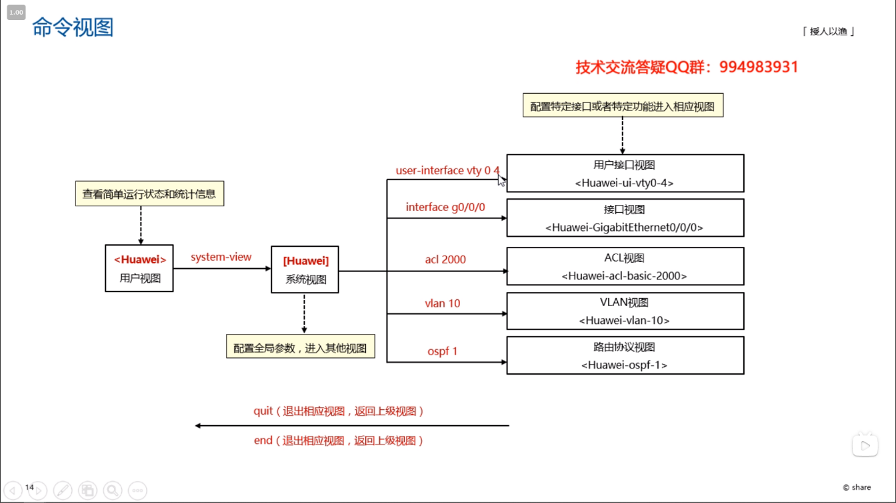
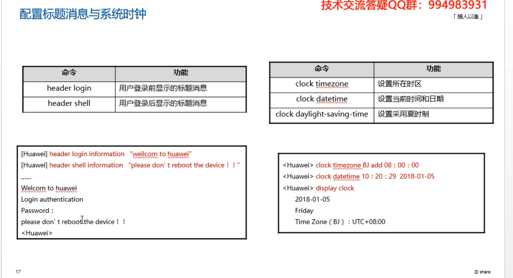
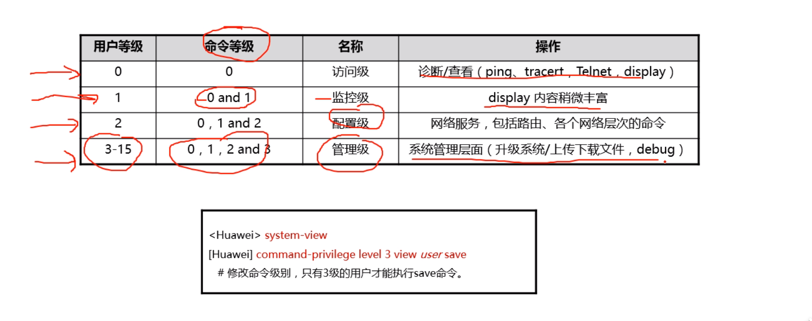
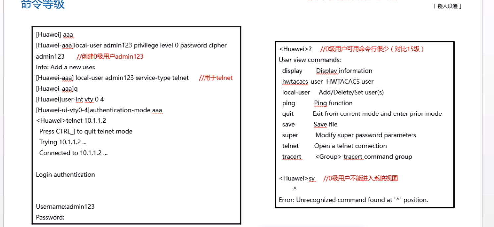

```

// 一般都需要进入系统视图
system-view

// 更改设备名称
sysname router-1

```


### user-interface vty 0 4 详解

  

```
Quidway]user-interface vty 0 4                    ；进入虚拟终端

[S3026-ui-vty0-4]authentication-mode password           ；设置口令模式

[S3026-ui-vty0-4]set authentication-mode password simple 222 ；设置口令

[S3026-ui-vty0-4]user privilege level 3  
```


一、第一句的意思是：进入到vty 终端，在华为的交换机里，vty就是人家用telnet远程进入到你交换机的界面，最多有五个，所以说你可以vty 0  vty 1 vty... vty 4交换机最多可以允许五个人同时在线进到交换机里去配置命令的。vty0 4 就是说把这五个界面一起配置了，这五个界面进去的话，都是使用以下的配置。

二、用的认证模式是密码认证，可以使用scheme模式来，也可以用password来，用password的话，是要密码的，就是说你telnet的话，要输入密码才能登陆到包交换机里去的。

三、设置密码为明文密码，密码是123 ，如果是密文的话，就是cipher

四、用户等级为3，也就是最高的，华为的命令级别很多，分为四级，0 1 2 3 ，0是参观级，只能看，1比0要高，可以使用一些命令，2 是可以配置了，3可以备份与删除IOS啦，呵呵，这个命令就是说用这个123密码，进来就是最高级别的，不用换级别。


### 交换机

```
// 进入系统视图
system-view

// 关闭信息中心
undo info-center enable

// 查看交换机当前配置
display current-configuration

// 显示所有接口信息
display interface

// 显示VLAN信息
display vlan

// 显示指定接口信息
display interface Ethernet0/0/1

// 进入接口
interface Ethernet0/0/1

//显示当前接口配置信息
display this

// 退出当前视图
quit

// 保存配置
save

// 重启交换机
reboot

// 用户视图下执行,可清空设备下次启动使用的配置文件内容，并取消指定系统下次启动时使用的配置文件，重新启动方可生效
reset saved-configuration

```


```
// 查看交换机MAC地址表
display mac-address

// 将MAC地址与接口静态绑定
mac-address static 5489-9812-68f7 Ethernet0/0/1 vlan 1

// 关闭Ethernet0/0/1接口的MAC地址学习功能
interface Ethernet0/0/1		// 首先进入接口
mac-address learning disable action discard
```


### 批量创建VLAN

这条命令的意思就是创建一次性创建vlan 1、2、3、100、103

```
vlan batch 1 to 3 100 103
```


### VLAN

```
// 批量创建VLAN10, VLAN20，vlan batch 是批量创建vlan，也可以一条一条手工创建
vlan batch 10 20

// 进入接口 Ethernet0/0/1
interface Ethernet0/0/1

// 配置接口类型为Access
port link-type access

// 将Ethernet0/0/1划分到VLAN10
port default vlan 10

// 进入vlan10
interface vlanif 10

// 设置ip地址
ip address 192.168.64.254 24

// 显示当前路由表信息
display ip routing

```


### 配置交换机的远程登录管理 Telnet

```
// 开启telent服务
telnet server enable

// 开启VTY线路模式，并进入配置线路0-4
user-interface vty 0 4

// 配置telnet 协议
protocol inbound telnet

// 配置认证方式
authentication-mode aaa

// 退出
quit

// 进入aaa模式
aaa

// 设置用户名和密码，其中cipher 表示密码进行了加密，simple表示明文密码
local-user qiuyeyijian password cipher qiuye123

// 将管理员的账号权限设置为15
local-user admin privilege level 15

// 退出
quit

```


### 路由器

```
// 进入相应接口
interface g0/0/0

// 设置对应的IP
ip address 192.168.1.1 24

```


### 配置RIP协议

```
// 使用rip
rip

// 发布网段号
network 192.168.1.0
```


### IPV6

```
// 启用路由器IPv6报文转发能力
ipv6

// 进入相应接口
interface GigabitEthernet0/0/1

// 在接口上启用IPv6功能
ipv6 enable

// 设置ipv6 地址
ipv6 address 1::1 64

// 配置 R1 到 2::  64 网段的路由
ipv6 route-static 2:: 64 3::2

```


### ACL访问控制列表

两个方向：入口inbound是指数据流进入路由器（进门），出口outbound是指数据流从路由器流出（出门）两种动作：允许permit、拒绝deny。

基本ACL是基于源地址进行过滤，所以应该放在目的端路由器

高级ACL，基于目的地址，放置在源端的路由器

```
// 基本访问控制
acl 2001

// 命令 编号id 动作 源ip 反掩码
rule 5 permit source 172.16.10.3 0
// 拒绝 172.16.10.0 这个网段通过
rule 10 deny source 172.16.10.0 0.0.0.255
// 添加相关描述信息  description + 描述语句，相当于备注
description Permit only 172.16.10.3 through

// 将acl应用到虚拟接口
user-interface vty 0 4
// 应用acl
acl 2001 inbound

// 将acl应用到接口
interface g0/0/1
traffic-filter inbound acl 2001


```

